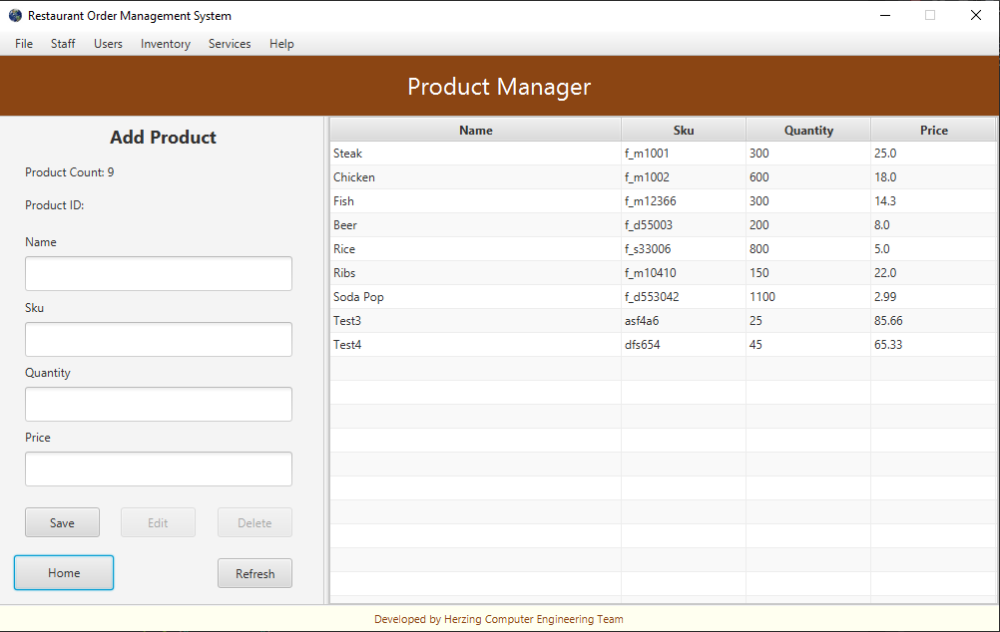
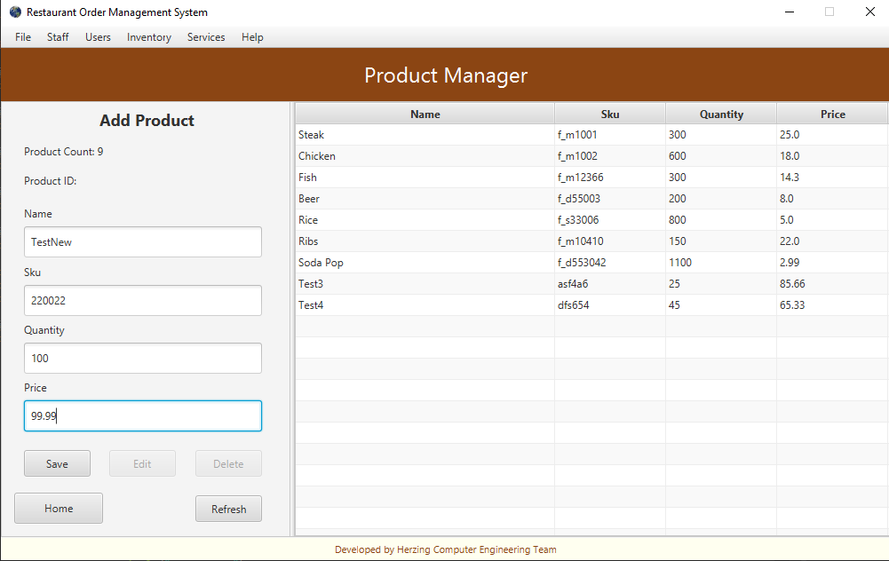
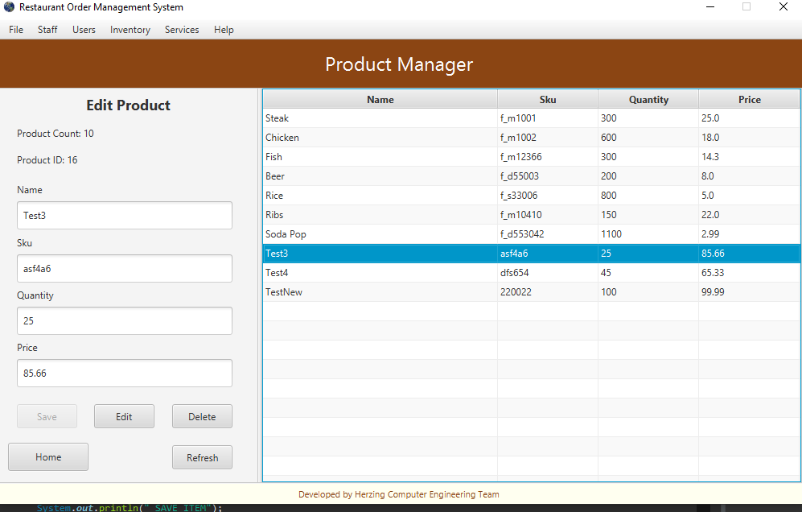
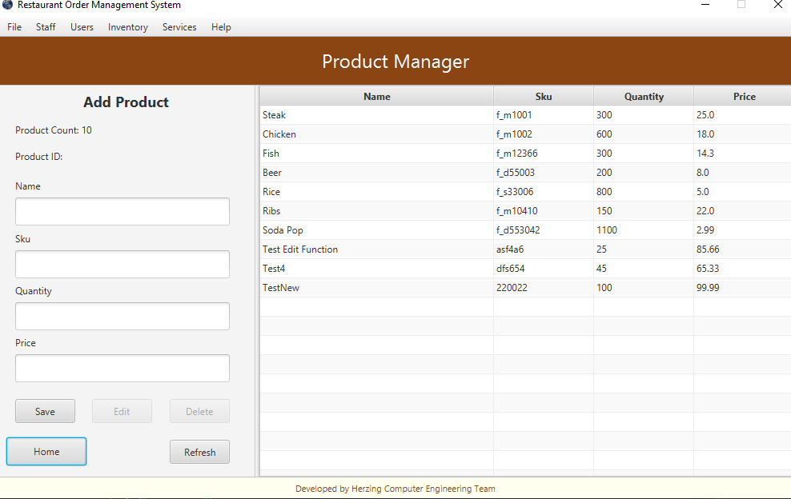
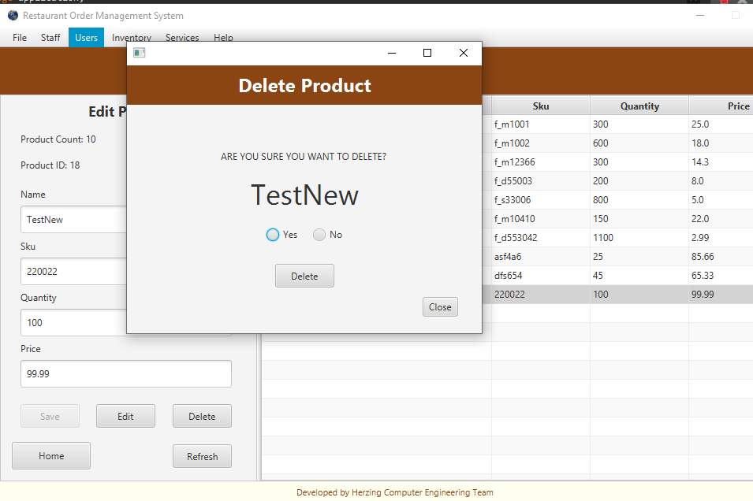
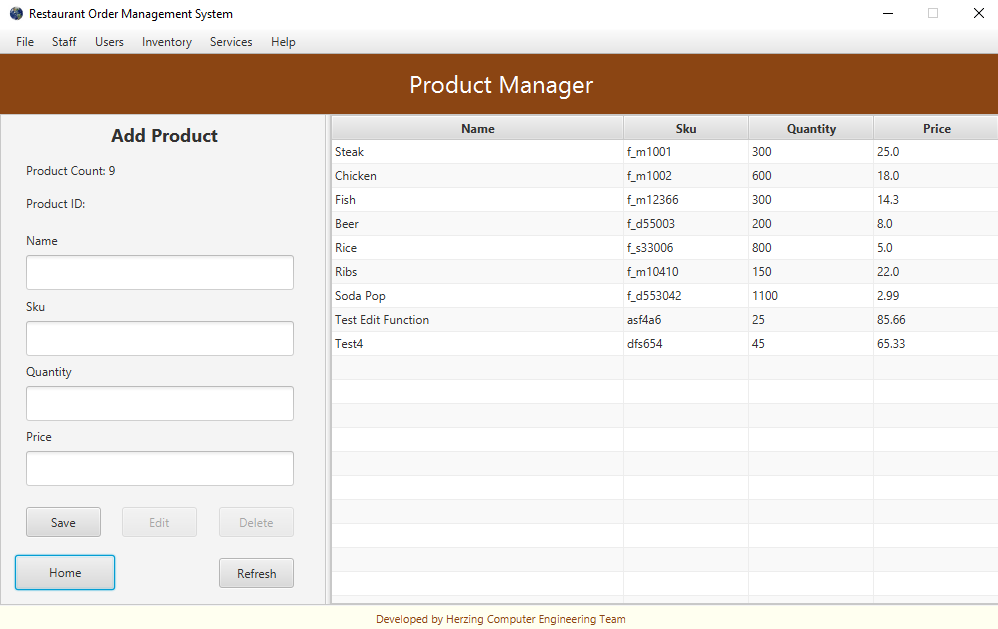
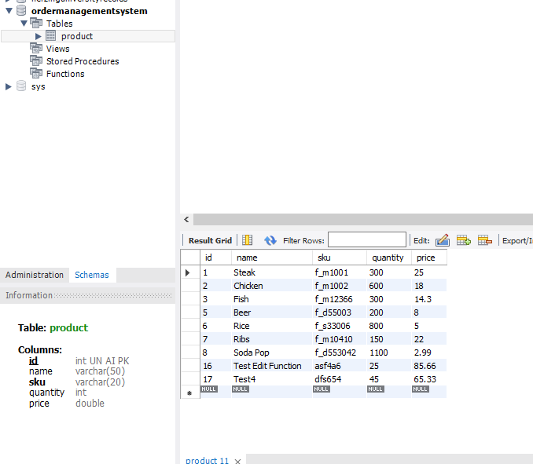
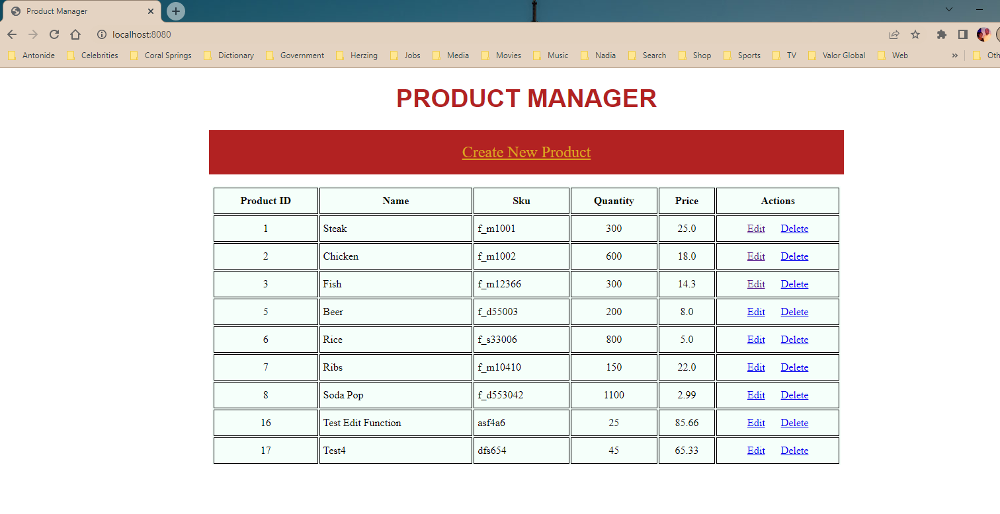

# Herzing-SE7

## Description:
Here is the JavaFX back-end order management system. I only had time to complete one CRUD process in full.
Buttons are in place for more services. This OMS will display the product objects from the mysql database.
The user can create, edit, and delete products, all from the Product Manager Page.

## Team:
Frank James

## OMS Landing Page (Udated):
Still needs a bit of work, but moving in the right direction. 
Product Manager button and MenuItems selection are working.

## Product Manager Page:
This is the Product Manager Page. All CRUD functions work. 
Table view working.

## Create Product:
To create a product just fill in the form and press save. 
Validations are not built in for this demonstration.

## Edit Product:
Notice the new 'TESTNEW' product at the bottom of list. 
We will edit 'TEST3' product.

## Product Manager After Edit:
Notice test3 now says 'TEST EDIT FUNCTION'

## Delete Product:
We will delete the 'TESTNEW' product. 
Pop up window with confirm question.

## Final Product Manager:
Final view with deleted 'TESTNEW' Product.

## MySQL (After OMS Changes in JavaFX):
MySQL workstation view, query everything from product table.

## Springboot (After OMS Changes in JavaFX):
Changes match on the Spring Boot server.

